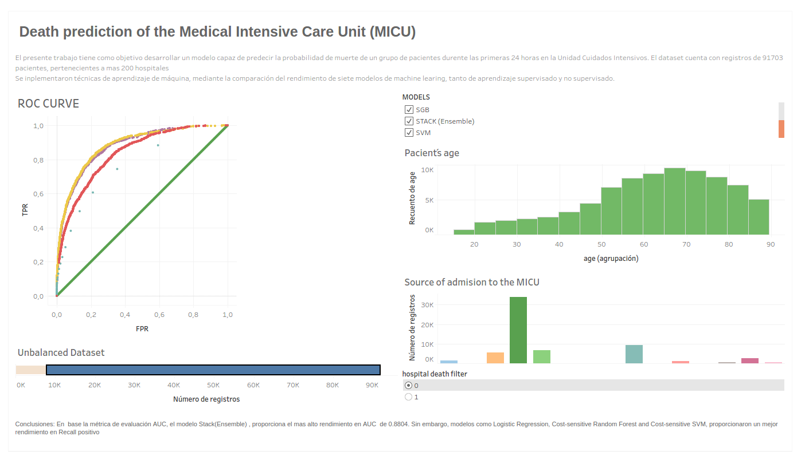

WiDSDatathon
============

En la unidad de cuidados intensivos de los centros de salud, cualquier tipo de información
que permita prever las posibles condiciones de los pacientes, es de vital importancia. En
este sentido, los datos son una potente herramienta para la toma de decisiones eficaces de
los médicos. El presente trabajo plantea cumplir los siguientes objetivos:\

1. Identificar patrones de las personas que tiene un alto grado de mortalidad para que
los médicos puedan dar prioridad a estas personas. Aunque se conoce que en
ciertos casos en los cuales los recursos son limitados se tiende a dar prioridad a las
personas que tienen más probabilidad de sobrevivir.\
2. Aplicar y consolidar los conceptos aprendidos en el transcurso del curso minería de
datos en casos reales.\
3. Implementar técnicas de aprendizaje de máquina para estimar la probabilidad de
morir de los pacientes que ingresan a la UCI*
4. Trabajar en un equipo multidisciplinario.\
5. Aumentar nuestra experiencia en eventos de análisis de datos en la plataforma
kaggle.\
6. Adquirir conocimientos que no están relacionados a nuestra área profesional.\

Resultados:
-----------

* Aplicar regularización redujo significativamente la cantidad de features
sin perder interpretabilidad a diferencia de pca y sin perder tanta información.\
* El preprocesamiento de datos y selección de features, tuning de
hiperparámetros permitió mejorar cada uno de los modelos definidos e
implementados. Esto se puede ver claramente en las gráficas roc y en las
tablas 4 Y 5 con la información de recall positivo y recall negativo.\
* El algoritmo de ensamble de clasificadores mejorar el recall positivo a cambio
de decrementar el recall negativo, pero al final obtuvo el mejor equilibrio entre
ambas métricas.\

Dashboard:
----------

[ONLINE](https://public.tableau.com/profile/denisse.orozco#!/vizhome/Machine_learning/Dashboard1?publish=yes)

### Autores ###
* Gálvez Eunice [github](https://github.com/eagalvez)
* Leiton Mauricio [github](https://github.com/mdleiton)
* Orozco Dennise [github](https://github.com/DenisseO) 
